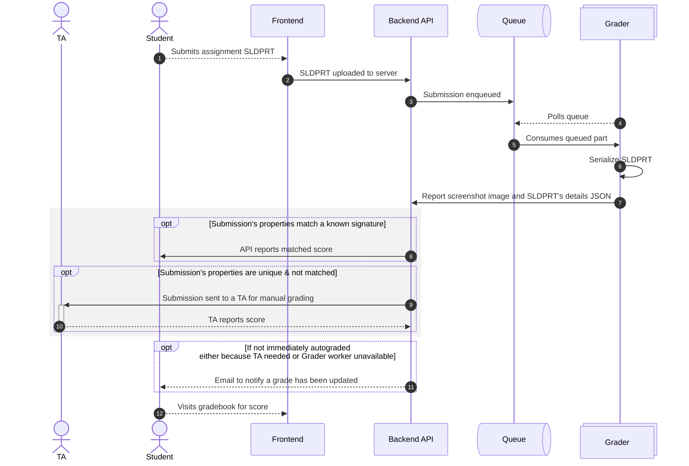

## Introduction: Starting with the problem

As with all successful projects, the key is to start with a problem that needs solved. In this case, I was acutely aware of the need for this project through my experience as a teaching assistant for a freshman engineering class.

This course, "Engineering Fundamentals Studio", is a 1000-level engineering class focused on teaching students to take their ideas from their head and get them onto paper and into a computer. We do this by discussing technical drawing, computer aided design with SolidWorks, 3d printing, rendering, and more. My project focuses on the SolidWorks portion of the course.

My team of TAs valued providing meaningful feedback to students so they could not only correct their assignments/work, but learn and understand what they did right, what they did wrong, and how to improve for future submissions. That said, doing this takes a lot of time, proving to be a challenge for both the undergraduate TAs who have to balance teaching and grading with their own course loads and for the course's budget as it was stretched thin with all the hours the TAs were putting into homeworks.

Before FeatureBench our grading pipeline was as follows:
1. Students visit Canvas to retrieve the expectations of the assignment (typically delivered as a PDF)
1. Students create the part in SolidWorks
1. Students upload their SolidWorks document (SLDPRT) to Canvas
1. A TA downloads the SLDPRT and opens it on their own device
1. TA computes the volume and surface area of the document and compares it to a known good part's volume and surface area

If the volume and surface area (mass properties) match, we know that the parts are the same. If they do not match, we know the student did something wrong.

To alleviate some of this pressure, I created FeatureBench to take care of some of the rote parts of grading. Students submit their homework to FeatureBench and FeatureBench automatically opens their SolidWorks part, grabs an image of the part, and computes the volume and surface area. If the volume and surface area match, the student is assigned a perfect score. If they do not match, FeatureBench attempts to match it to known common mistakes (manually entered) and score accordingly.

If FeatureBench is unable to match a submission to a known signature, it puts it forward for a TA to grade. This saves TAs time because they don't have to waste time grading correct assignments, they can focus their time and efforts on providing meaningful support to students.

## Technical Overview

### Architecture

FeatureBench is broken into 3 major components:
- The frontend UI, written in React responsible for interfacing with students, teachers, and TAs.
- The backend API, responsible for serving the frontend, handling file uploads, payments, and emails.
- The grader worker, responsible for running SolidWorks and serializing SLDPRT submissions into JSON.

**Sequence of a submission/grading lifecycle**

Below is a sequence diagram of what a submission looks like as it moves through the pipeline.

1. **Student uploads a SLDPRT**. When students submit homework/assignments on FeatureBench, they do so by submitting a .SLDPRT file. This is a simple file upload submission.
2. **SLDPRT uploaded to server**. The SLDPRT is submitted to the server. No grading or compute happens on the client-side. Once the SLDPRT is uploaded, the client begins polling the server every 5 seconds for the next 1 minute to see if the assignment has been graded. Once 1 minute passes, the student is informed that they will recieve an email when their submission is graded.
3. **Submission enqueued**. Some basic information about the submission is persisted to a db, the SLDPRT file is uploaded to S3, and a reference is put into a queue* for the grader.
4. **Polls Queue** (combines with 5)
5. **Consumes queued part**. When its ready, the worker pulls a part from the queue
6. **Serialize SLDPRT**. Using the SolidWorks API, we convert the SLDPRT from its proprietary format into data we can work with, including an image of the part, a STEP file (non-proprietary 3d format), and a JSON object of the document's metadata, feature tree (the part's "history"), and mass properties info.
7. **Report screenshot image and SLDPRT's details JSON** to the backend API via a webhook.
8. *[IF mass properties match a signature uploaded by the teacher]* **Report matched score**. In the assignment creation process, teachers upload a "perfect" example SolidWorks document. We run the typical grader worker on that, but use the output to define what "perfect" is for that assignment. Optionally, teachers can upload other "perfect" parts or upload examples that would recieve partial credit. If a student's submission matches any of these, we pull the grade and feedback from what the teacher set up, and report that to the student.
9. *[IF mass properties don't match a known signature]* **Submission sent to TA for manual grading**. When manually grading, the TA has an option to add their feedback as an additional part signature so the autograder catches the same mistakes in the future. When a new part signature is set up, all pending assignments are tested against it to match.

#### *A Queue?

A queue is used rather than directly requesting the grade from the worker for resilience and load balancing purposes. The grader worker has a few important limitations:
- **Non-concurrent processing**. A single grader worker can only process one submission at a time, and processing a submission can take anywhere from 1 second to several minutes. Directly requesting grading attempts risks multiple submissions being submitted in quick succession, confusing the running SolidWorks instance.
- **Instability**. The grader workers are inherently less stable than ideal for a production server. They are on a Windows Server instance running SolidWorks and a thin queue consumer application. There are cases where a complex SolidWorks part is submitted and takes a long time to load. This loading may fail, resulting in an indeterminate state. *If such an indeterminate state is reached, the worker is completely hardware-level rebooted.*
- **File complexity**. Some files may be extremely large or complicated (file size and part complexity are not necessarily linked), so the architecture needs to endure an extremely long waiting period without losing track of any user submissions.

Using a queue allows the worker to manage its own schedule. It pulls in a single submission from the queue, processes it, cleans up, and once done, pulls in the next.

An external queue allows submissions to be enqueued regardless of the worker's state, ensures data consistency, helps prevent accidentally losing track of a user's submission, and *allows for horizontal grader scaling*. If a single grader worker gets too bogged down or the queue grows to be too long, we can just spin up another grader worker and it goes to work immediately.

### Resiliency

Being an academic technology where students interact regularly and to do their homework, resiliency is critical through the entire application's stack. FeatureBench strongly adheres to the KISS (keep-it-simple-stupid!) model of product design. It doesn't have any unnecessary features, extra filler to make a pricing table look good, or corner features to cover non-standard assignments. Our objective is to simplify the grading process by automating the boring stuff. By staying focused on this objective, we can reduce overall complexity and surface area, allowing extra care for the most important things TAs need.

As discussed in the "A Queue?" section, decoupling the SolidWorks grading worker from the main backend API process is critical to keeping FeatureBench online and snappy. Beyond that, the actual backend API is stateless and only focused on handling requests. As such, there is a hot replica always available. If the backend API goes down or response times increase, incoming requests will be redirected to the hot replica, and the user will never know the difference.

Ensuring code is high quality before it reaches the main production branch is critical to the success of FeatureBench. Once code gets pushed to a development branch, we run a suite of automated end-to-end tests to ensure that the entire application is working as expected and there are no unexpected side-effects of the code change.