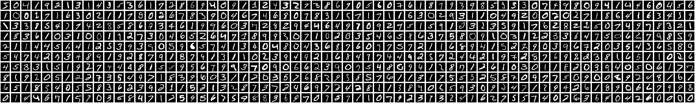

<!--
  Notes:
  - `author` should match a name in `_data/AUTHORS.yml`.
  - Put images, CSV files, JSON files, and other assets beside this file.
  - See `_resources/writing-guide/index.md` for diagrams, math, code blocks, and charts.
-->

<!-- Start writing here. -->

## Introduction

I saw an incredible video on YouTube about someone who built a computer using just the flow of water [^1], and the creator demonstrated how he set up gates and was able to string them together to form a 4-bit adder.

It was an incredible demonstration of the power of simply pouring water and its natural tendency to flow in all directions but up. This got me thinking about how far we could push water to solve problems. If he was able to create XOR and AND gates, then naturally we could create the other common gates and build a computer that could solve any problem (albeit very slowly).

This brought me back to my introduction to Electrical Engineering and Fluid Dynamics courses and it really got me thinking about how almost everything in Fluid Dynamics and Thermodynamics are just rephrasings of electrical engineering problems. Insulators are just resistors, flow is just a current, and so on. I began seriously thinking about how I could create a more significant computer using water, and using what I know about fluid dynamics and electrical/computer engineering, I began to think about how I could build a larger system.

The more I thought about it, however, the reality of being a college student without access to enough room, time, resources, or energy to build a project like this began to set in. While up late studying for my Calculus III and Fluid Dynamics final exams, it hit me that fluid flows around diferent objects diferently, and if I could simulate the fluid flow around an object, I could find a way to store information about the simulation and use some vector nearness to find the nearest neighbor, and hopefully recognize the object. This follows the story of how I did that.

## The Problem

Like any good project, the first step was to define the problem. I suppose that this would be some kind of AI classification problem. Seeing that a number classification model is a common first step in many machine learning educations, I decided to use that as my starting point.

There is a dataset published by the National Institute of Standards that provides thousands of samples of hand written digits, colloquially known as the MNIST dataset. I downloaded the MNIST dataset [^2], extracted the images, and I started researching to find if someone had any ideas that I could bounce off of and found a video [^3] of someone doing almost exactly what I was trying to do.



*Figure 1: A sample of the MNIST dataset.*

## The Solution

After processing in the images, I began processing the data. I had to find a way to represent the image data in a way that I could convert into an n-dimensional vector. I began thinking about how, given (for example) the number 3, pouring water over the top would allow all the water to flow downwards and none would be captured. However, if I rotated it 90 degrees clockwise, the water (pouring from the new top) would be captured in the curved bit of the 3. If I recorded how much water was captured in each orientation, I could use that to create a vector to group common features together.

The more I considered it, I began to realize the issues I would have distinguishing between numbers like 6 and 9, seeing that they have similar features in diferent orientations and areas. After watching [^3], I recognized that if I could break the retained and blocked water into 8 regions: the left and right halves of the original, 90 degrees clockwise, 180 degrees, and 270 degrees, I would be able to embed not only the presence of features, but the general position of said features.

<video autoplay loop muted>
  <source src="3-all-orientations.mp4" type="video/mp4">
</video>

Given the flow patterns above, we can construct a 9-dimensional vector that represents the total number of fluid pixels (where the search algorithm is allowed to propagate in all directions rather than just three), followed by the number of filled pixels on both halves of each of the four orientations. This gives us an understanding of both the features of the digit, but also the size of any enclosed spaces.

Running the pipeline on this variant of a 3 as shown above, we get the following vector:

$$
\langle
\color{forestgreen}684
\color{black},
\color{purple}327
\color{black},
\color{purple}343
\color{black},
\color{orange}272
\color{black},
\color{orange}324
\color{black},
\color{teal}317
\color{black},
\color{teal}341
\color{black},
\color{red}361
\color{black},
\color{red}316
\color{black}
\rangle

$$

I then ran the "training" script which calculates this vector for each image in the dataset, and got over 60,000 vectors. While it is a 9-dimensional vector, we can reduce it to a 2d graph by picking two scalars and plotting them against each other. This is not useful for the actual learning process, but does give us a great way to visualize the data.

```plot vectors="vectors.json"
Plot.dot(vectors, {
  x: (d) => d.vector[5],
  y: (d) => d.vector[7],
  stroke: "character",
  fill: "character",
  r: 1,
  <!-- tip: true -->
}).plot({
  x: { domain: [120, 400], label: "90 degree right half" },
  y: { domain: [240, 390], label: "180 degree left half" },
  color: {
    type: "ordinal",
    scheme: "category10",
    legend: true
  },
});
```

This plot shows the 90 degree right half and the 180 degree left half of all the data in the dataset. By looking at colored groupings, we can see that the different groups have grouped themselves together. While there is a lot of noise and overlap in regions, this is alleviated by comparing nearness in the 9-dimensional vector space.

From our 9-dimensional point cloud, the last step is to identify the closest neighbor to a new, unseen. We can do this using the Euclidean distance formula of an n-dimensional vector:

$$

\sqrt{(x_1 - x_2)^2 + (y_1 - y_2)^2 + \cdots + (*_n - *_n)^2}

$$

Running this between a new vector and all vectors in the dataset, we get a list of distances that we can use as a score, then return the closest neighbor. Now, given a new, unseen image of a number (in the correct format), we can extract features from it, evaluate them, and connect them to other similar characters in the dataset.

We can significantly improve the accuracy of this last step by using k-nearest neighbors rather than just the closest neighbor. This migration resulted in a 4% increase in accuracy.

## The Final Product

This project resulted in a classifier and model that can classify numbers with roughly 85% accuracy. Definitely not adequate for any real-world use, but I enjoyed the learning excercise of creating character recognition model without using the "common" approach.

## Reflections: Human behaviors exposed in the data

The plot of two components shown earlier is interesting, though, because it shows both how the data gets pulled into groups even in this 2-dimensional space, but we can also identify some cool trends about the different ways folks write.

```plot vectors="vectors.json"
const regionA = [
  { x: 140, y: 370, shape: "A" },
  { x: 180, y: 380, shape: "A" },
  { x: 200, y: 325, shape: "A" },
  { x: 140, y: 325, shape: "A" },
  { x: 140, y: 370, shape: "A" } // close it
];

const regionB = [
  { x: 205, y: 385, shape: "B" },
  { x: 250, y: 385, shape: "B" },
  { x: 270, y: 355, shape: "B" },
  { x: 220, y: 340, shape: "B" },
  { x: 200, y: 360, shape: "B" },
  { x: 205, y: 385, shape: "B" } // close it
];

const images = [
  { x: 140, y: 325, src: "struck-7.png" },
  { x: 220, y: 340, src: "traditional-7.png" }
];

return Plot.plot({
  x: { domain: [120, 300], label: "90 degree right half" },
  y: { domain: [300, 390], label: "180 degree left half" },
  color: {
    type: "ordinal",
    scheme: "category10",
    legend: true
  },
  marks: [
    Plot.dot(vectors, {
      x: (d) => d.vector[5],
      y: (d) => d.vector[7],
      stroke: "character",
      fill: "character",
      r: 2
    }),

    Plot.line(regionA, {
      x: "x",
      y: "y",
      stroke: "red",
      strokeWidth: 2
    }),

    Plot.line(regionB, {
      x: "x",
      y: "y",
      stroke: "blue",
      strokeWidth: 2
    }),

    Plot.image(images, {
      x: "x",
      y: "y",
      src: "src",
      width: 30,
      height: 30
    })
  ]
})
```

For example, the red region outlined above defines mostly 7's with lines through them, and the blue region defines 7's without lines through them.

---

## Citations

[^1]: https://www.youtube.com/watch?v=IxXaizglscw
[^2]: https://www.kaggle.com/datasets/hojjatk/mnist-dataset
[^3]: https://www.youtube.com/watch?v=CC4G_xKK2g8
