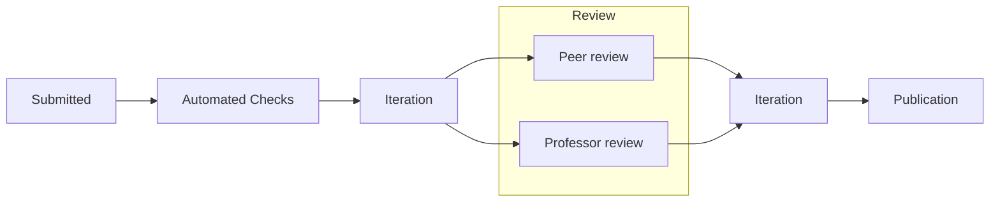

README files are great. They are a way for developers to communicate the basics of how to run, develop, debug, and deploy a project. It provides a way for developers to explain their project to others, and exposes something of a user guide for perspective contributors and users. Unfortunately, the most interesting conversations of a project happen far too deep in the weeds to be captured in a README. Build@SLU OSS is a project that provides members of the SLU OSS community a place to publish deep dives on their work.

## Rigor at Build@SLU OSS

Build@SLU OSS is a **rigorous** program that invites members to submit deep dives on their work, whether that be interesting problems faced in schoolwork, challenges faced in side projects, or just interesting topics worth sharing.

What differentiates Build@SLU OSS from other blogs is it's **rigor** and **high standards**. These expectations give credibility to the work published on Build@SLU OSS, and provide a way for members to be recognized for their work in an academic setting.

## The Process

The objective of publishing a paper on Build@SLU OSS is a way for students to publish their work in an environment with a strong reputation for high standards, and for participants to engage in constructive discussions about their work with their peers. The process is designed to be a place for ideas to be challenged, understandings to be expanded, and solutions to be refined. As such, the paper that is published may vary greatly from the one submitted.

All conversations about the paper are conducted in a public GitHub PR thread that will be linked to the paper's published page so viewers can see the iteration and engage in conversations about the paper.

## Who should get involved?

The short answer is **you** should get involved. More specifically, students wishing to submit a paper should first meet the following criteria:

- Be a student at SLU or otherwise involved in the SLU OSS community.
- Be a computer science student or demonstrate strong skills via their submission.
- Be interested in their work being published to the general public.
- Consent to their work being promoted by SLU, SLU OSS, and/or members of the community.
- Be willing to engage in good-faith discussions regarding their work both during and after submission.
- Abide by the SLU OSS and Build@SLU OSS policies and procedures, including those regarding generative AI.

## What are we looking for?

We are looking for writeups of interesting projects (or parts of projects) that you have worked on. It does not matter if the project is a side project, class project, for research, or anything else (it can even be a proof-of-concept just for your publication!). We believe a rising tide lifts all ships, so we encourage you to submit whatever you find interesting.

That said, not all projects may be able to stand up to the rigor and expectations of a publication on Build@SLU OSS. For acceptance, we will be looking for projects that:

- Demonstrate and apply an understanding of a concept exceeding that of the average developer.
- Does something in a different/novel way that provides some insight into the field or problem.
- Is solving a problem complex enough that few others have exposure into the inner workings.
- Upends existing (or common) limitations to a problem (an efficient solution to a known problem).
- Boils a complex problem to something the average technically inclined reader can understand.
- Bridge multiple disciplines. This could include (but is not limited to) problems that span multiple engineering fields, involve people management, or involve integrations with the real world.

Papers do not have to be written by one person!

## What makes a great paper?

A great paper is one that:

- Is well-written and clearly communicates the problem and solution.
- Uses evidence to support claims (benchmarks, experiments, comparisons, or formal reasoning).
- Is well-organized and has a logical flow (with a clear introduction, main body, and conclusion).
- Has useful graphics and diagrams.
- Establishes a baseline or control for comparison (e.g., existing methods, naive approach).
- Not only provides data and solutions, but interprets them in a way that is useful to the reader.
- Sets you as the author apart from the crowd, both in its technical and communicative aspects.
- **Tells a story**
