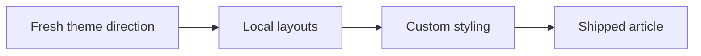
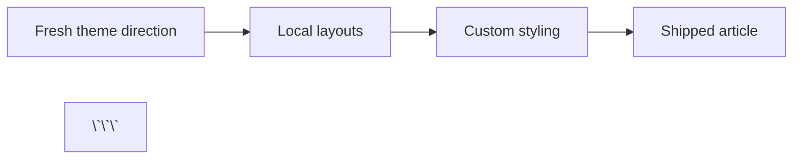

A great paper starts with a great idea of solving an interesting problem. Build@SLU OSS will judge the quality of the underlying work by the level of demonstrated understanding of the problem and implementation of a solution. Once you have your problem solved, you need to write about it. This guide is intended to help you write a great paper, and to take advantage of the features of Build@SLU OSS.

## Markdown

Build@SLU OSS uses Markdown to write papers. All common Markdown features are supported. Some additional features are supported, including citations, and are documented here.

### Citations

Footnote-style citations are supported using `[^1]` references in the body and matching definitions at the end of the document.

```md :filename="writing-guide/index.md"
Fluid computers can still implement logic gates.[^1]

## Citations

[^1]: Reference text, URL, paper title, or other source details.
```

If a citation marker like `[^1]` appears in the body without a matching definition later in the document, it will render in red as a missing-citation warning.

### Plotting

Using [Observable Plots](https://observablehq.com/plot/), you can create interactive charts and graphs from your data.

```plot olympians="olympians.csv"
Plot.dot(olympians, {
  x: "weight",
  y: "height",
  stroke: "sex",
  channels: { name: "name", sport: "sport" },
  tip: true
}).plot({
  color: {
    domain: ["male", "female"],
    range: ["#01A6EA", "#F678A7"]
  }
})
```

The syntax is as follows:

```md :filename="writing-guide/index.md"
\`\`\`plot olympians="olympians.csv"
Plot.dot(olympians, {
  x: "weight",
  y: "height",
  stroke: "sex",
  channels: { name: "name", sport: "sport" },
  tip: true
}).plot({
  color: {
    domain: ["male", "female"],
    range: ["#01A6EA", "#F678A7"]
  }
})
\`\`\`
```

For more examples, see Observable Plot's [examples](https://observablehq.com/@observablehq/plot-gallery). Input data can be CSV or JSON files. Observe how the data was passed to the plot expression, with `olympians=olympians.csv`. The name of that input does not matter, but it must be the same name of the input to the `Plot.*` expression. The source data file is available in the same directory (colocated) as the article file.

Plot blocks accept normal JavaScript comments, including both `// line comments` and `/* block comments */`.

### Code Blocks

Code blocks are available using the triple backticks syntax with a few additional features.

```html :linenos=12 :highlight={13} :filename=index.html :filehref=https://github.com/oss-slu/build/blob/main/index.html
<section class="hero">
  <h1>Build something interesting.</h1>
</section>
```

As you can see in the above example, the code block has a few additional features, including the inclusion of line numbers, syntax highlighting, and more.

| Feature | Example | Description |
| --- | --- | --- |
| Line numbers | `:linenos` or `:linenos=12` | Line numbers are shown on the left side of the code block. If no number is provided, numbers start at 1, otherwise they start at the provided number. |
| Highlight lines | `:highlight={1,3,5}` | Line numbers to highlight. |
| Filename | `:filename=app/index.js` | Filename to show at the top of the code block. This could be a file or a short reference detail. |
| Filename link | `:filehref=http://...` | If `:filename` is provided, this will make it into a link. |
| Icon |  | If `:filename` is provided and the language is whitelisted, an icon will be shown to the left of the filename. |

In order to render the above code block, we use this code:

```md :filename="writing-guide/index.md"
\`\`\`html :linenos=12 :highlight={13} :filename=index.html :filehref=https://github.com/oss-slu/build/blob/main/index.html
<section class="hero">
  <h1>Build something interesting.</h1>
</section>
\`\`\`

```

### Math

Math is supported using the [MathJax](https://www.mathjax.org/) syntax and supports latex.

$$
\rho \left(
\frac{\partial \mathbf{u}}{\partial t}
+ (\mathbf{u} \cdot \nabla)\mathbf{u}
\right)
=
-\nabla p
+ \mu \nabla^2 \mathbf{u}
+ \mathbf{f}
$$

In order to render the above math (navier-stokes equation for those curious), we use this code:

```md :filename="writing-guide/index.md"
$$
\rho \left(
\frac{\partial \mathbf{u}}{\partial t}
+ (\mathbf{u} \cdot \nabla)\mathbf{u}
\right)
=
-\nabla p
+ \mu \nabla^2 \mathbf{u}
+ \mathbf{f}
$$

```

### Diagrams (Mermaid)

Diagrams are supported using the [Mermaid](https://mermaid-js.github.io/mermaid/#/) syntax.



In order to render the above diagram, we use this code:

```md :filename="writing-guide/index.md"

